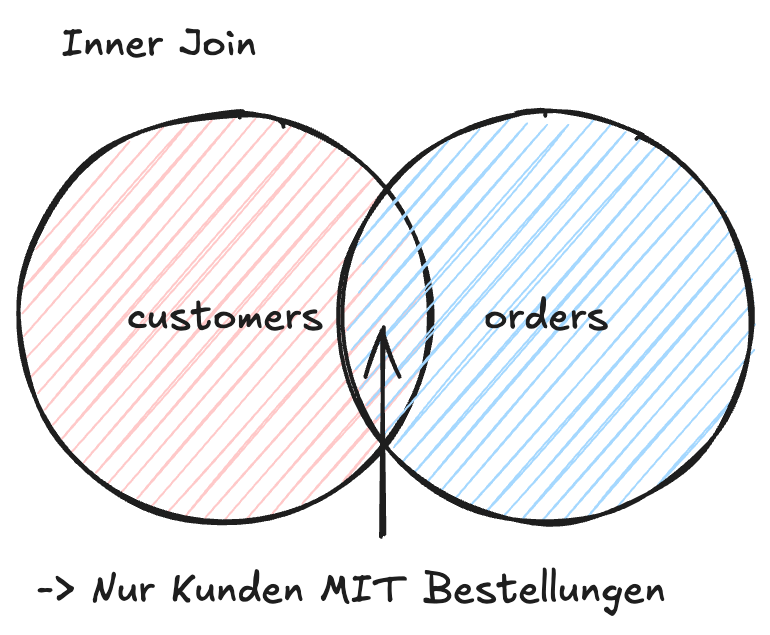
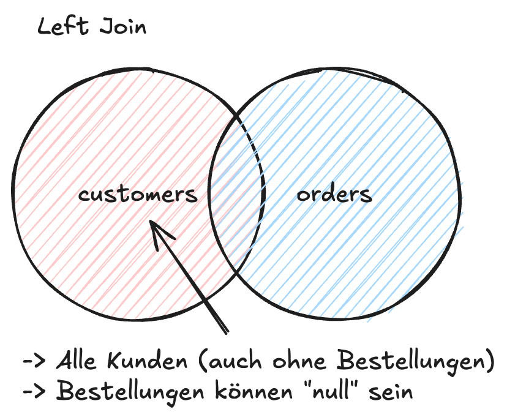
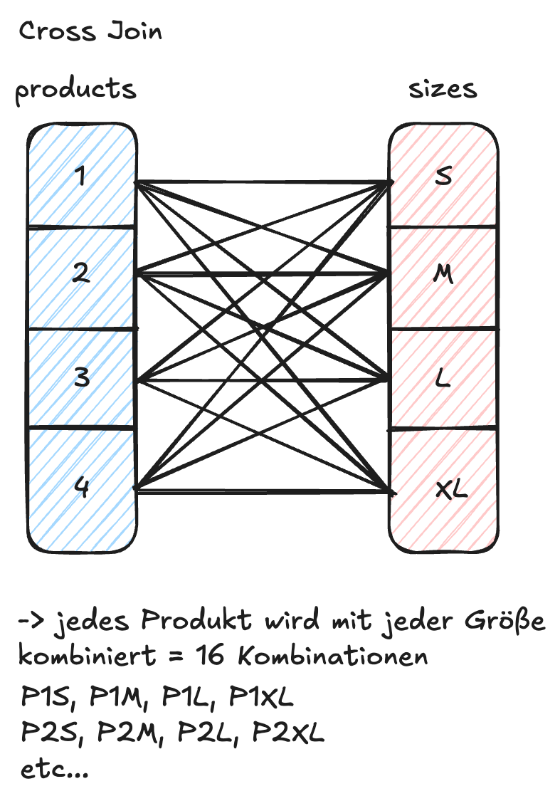
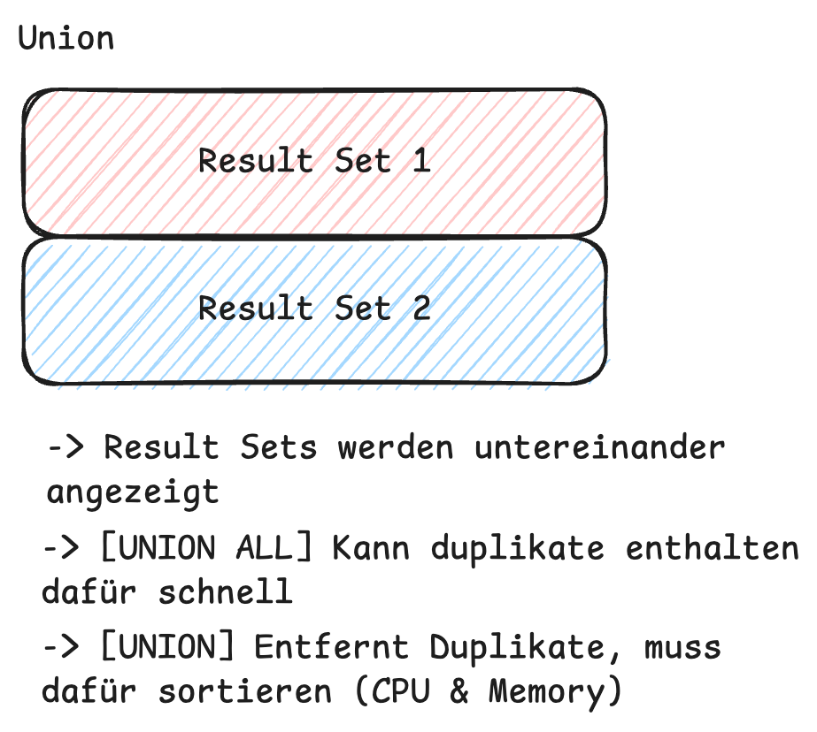

# Advanced SQL: Joins, Union & Subqueries

Wir bauen komplexe Berichte und Analysen. Hier trennt sich die Spreu vom Weizen: Wie effizient sind deine Joins?

## JOIN-Typen im Detail

### 1. INNER JOIN
Der Standard. Nur Matches aus beiden Tabellen.

```sql
SELECT e.first_name, d.dept_name
FROM employees e
INNER JOIN dept_emp de ON e.emp_no = de.emp_no
INNER JOIN departments d ON de.dept_no = d.dept_no;
```

### 2. OUTER JOIN (LEFT / RIGHT)
Alles von einer Seite, Matches von der anderen. `NULL` wenn kein Match.
*   **LEFT JOIN:** Alle Zeilen der *linken* Tabelle.
*   **RIGHT JOIN:** Alle Zeilen der *rechten* Tabelle (selten genutzt, meist reicht LEFT JOIN durch Umstellen).


:::info[Use Case]
Finde alle Kunden, die *noch nie* bestellt haben:
`SELECT c.name FROM customers c LEFT JOIN orders o ON c.id = o.c_id WHERE o.id IS NULL;`
:::

### 3. CROSS JOIN
Das kartesische Produkt. Jede Zeile mit jeder Zeile.

*   Vorsicht: 1000 Zeilen x 1000 Zeilen = 1.000.000 Ergebnisse.
*   Nutzen: Generieren von Testdaten oder Kombinationstabellen (z.B. "Jeder Wochentag für jeden Mitarbeiter").

### 4. SELF JOIN
Eine Tabelle mit sich selbst verknüpfen.
*   Nutzen: Hierarchien (Vorgesetzter ist auch Mitarbeiter) oder Vergleiche innerhalb einer Gruppe.

## UNION und UNION ALL

Kombiniert Result-Sets von zwei Queries (müssen gleiche Spaltenanzahl/-typen haben).

*   `UNION`: Entfernt Duplikate (Langsam, da implizites `DISTINCT`).
*   `UNION ALL`: Behält Duplikate (Schnell).


:::tip[Performance]
Nutze immer `UNION ALL`, es sei denn, du brauchst zwingend die Duplikat-Bereinigung. Der Performance-Unterschied bei großen Datenmengen ist extrem.
:::

## Subqueries

Abfragen in Abfragen.

### IN, ANY, ALL, EXISTS

*   `WHERE id IN (SELECT ...)`: Gut für kleine Listen.
*   `WHERE EXISTS (SELECT ...)`: Oft performanter als `IN` bei großen Subqueries, da die DB beim ersten Match abbrechen kann ("Semi-Join").

### Scalar Subqueries
Eine Subquery, die genau **einen Wert** (eine Zeile, eine Spalte) liefert. Kann überall stehen, wo ein Wert stehen kann (z.B. im `SELECT` Teil).

```sql
SELECT 
    name, 
    salary, 
    (SELECT AVG(salary) FROM salaries) as avg_salary -- Scalar Subquery
FROM employees;
```
*Achtung:* Wird pro Zeile ausgeführt! Bei großen Listen Performance-Killer. Besser: Window Functions (Tag 2) oder Join.
