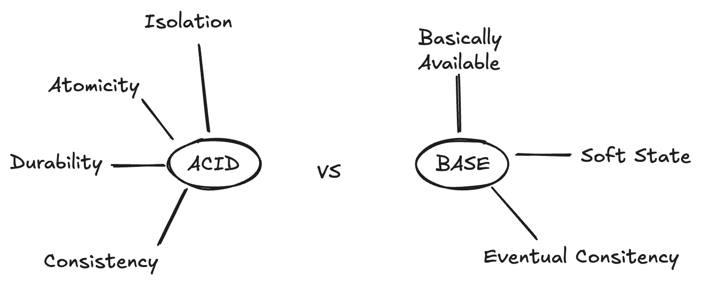

### ACID-Prinzipien von relationalen Datenbanken

Die vier Eigenschaften **A – C – I – D** beschreiben, wie Datenbank-Transaktionen zuverlässig ablaufen sollen:

1. **Atomicity (Atomarität)**

   * „Alles oder nichts“: Eine Transaktion wird entweder vollständig ausgeführt oder gar nicht.
   * Beispiel: Beim Geldüberweisen muss das Abbuchen vom Konto A **und** das Gutschreiben auf Konto B passieren. Wenn ein Schritt fehlschlägt, wird die ganze Transaktion zurückgerollt.

2. **Consistency (Konsistenz)**

   * Nach einer Transaktion muss die Datenbank immer in einem gültigen Zustand sein.
   * Regeln, Integritätsbedingungen und Constraints dürfen nicht verletzt werden.
   * Beispiel: Wenn eine Spalte nur positive Werte erlaubt, darf eine Transaktion keinen negativen Wert eintragen.

3. **Isolation (Isolation)**

   * Gleichzeitige Transaktionen dürfen sich nicht gegenseitig beeinflussen.
   * Für jede Transaktion sieht es so aus, als ob sie alleine ausgeführt würde.
   * Beispiel: Zwei Personen kaufen gleichzeitig das letzte Konzertticket. Durch Isolation wird verhindert, dass beide es bekommen.

4. **Durability (Dauerhaftigkeit)**

   * Einmal bestätigte Transaktionen bleiben dauerhaft gespeichert auch bei Stromausfall oder Systemabsturz.
   * Umgesetzt wird das z. B. durch Logs, Backups oder Replikation.

### BASE-Prinzipien von NoSQL-Datenbanken

BASE ist das Gegenstück zu ACID und beschreibt, wie viele verteilte, hochskalierbare Systeme arbeiten.
Es steht für: **Basically Available – Soft state – Eventual consistency**

1. **Basically Available (Grundsätzlich verfügbar)**

   * Das System garantiert, dass es **immer antwortet** auch wenn manche Teile fehlerhaft sind.
   * Beispiel: Ein Onlineshop zeigt dir die Produktliste, auch wenn ein Server gerade ausgefallen ist.

2. **Soft State (Weicher Zustand)**

   * Der Zustand der Daten kann sich **auch ohne neue Transaktion verändern**, weil Hintergrundprozesse (Replikation, Synchronisation) laufen.
   * Beispiel: Zwei Datenbanken gleichen sich nachträglich ab – der aktuelle Zustand kann sich währenddessen noch ändern.

3. **Eventual Consistency (Schlussendlich konsistent)**

   * Die Daten sind nicht sofort überall identisch, aber **mit der Zeit** gleichen sie sich an.
   * Beispiel: Du likest ein Foto bei Instagram dein Freund sieht es vielleicht erst 2 Sekunden später, aber irgendwann ist der Zustand bei allen gleich.
