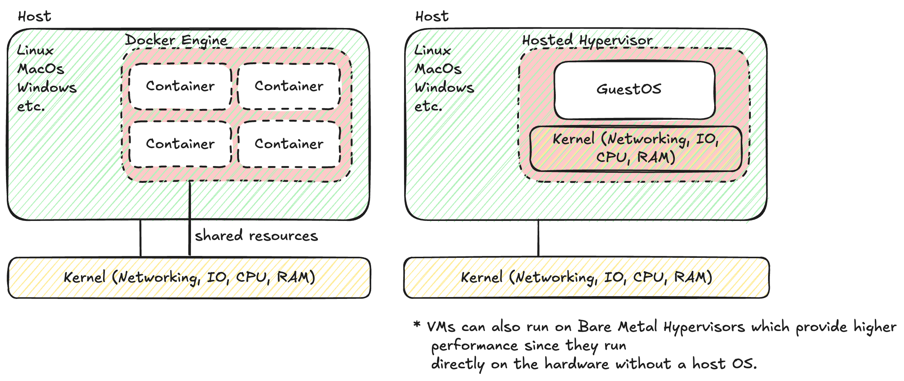
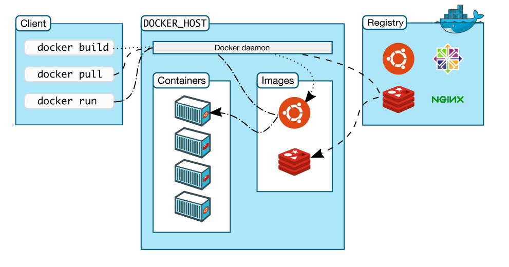

## Was ist Docker?

Docker ist im Grunde ein "Lieferservice für Code". Früher war es ein Albtraum, Software zu deployen:
- "Auf meinem Rechner läuft's!"
- "Ja, aber auf dem Server fehlen Libs X und Y."

Docker löst das, indem es deine App **und** ihre Umgebung (Libs, Configs) in ein immutables Paket packt: das **Image**.

### Container vs. VM

Das ist der Klassiker im Vorstellungsgespräch.



**Virtual Machines (VMs)** virtualisieren *Hardware*.
Der **Hypervisor** ist die zentrale Verwaltungskomponente. Er übernimmt folgende Aufgaben:
- **Hardware-Emulation:** Er stellt jedem Gast-OS virtuelle Hardware (CPU, RAM, Netzwerk) bereit.
- **Ressourcen-Isolation:** Er weist Ressourcen strikt zu und garantiert die Trennung.
- **Scheduling:** Er steuert die Verteilung der Rechenzeit auf die physikalischen CPUs.

Jedes Gast-OS operiert isoliert. Das bietet ein sehr hohes Sicherheitsniveau, erzeugt aber Overhead, da für jede Anwendung ein komplettes Betriebssystem gestartet werden muss.

**Container** virtualisieren das *Betriebssystem*.
Es gibt keinen Hypervisor. Alle Container teilen sich den **Kernel** des Hosts.
- **Größe:** MBs statt GBs (kein eigenes Guest-OS mitzuschleppen).
- **Speed:** Millisekunden (kein Boot-Vorgang, nur Prozess-Start).
- **Isolation:** Durch Kernel-Features:
    - **Namespaces:** "Was kann ich sehen?" (Prozesse, Netzwerk, Mounts).
    - **Cgroups:** "Was darf ich nutzen?" (CPU, RAM Limits).

:::info[Hintergrund]
Es gibt *technisch gesehen* keine "Container" im Linux Kernel. Es sind einfach normale Linux-Prozesse, die so stark isoliert werden, dass sie *denken*, sie wären eine eigene Maschine.
:::

## Installation & Setup Check

Wir installieren docker so:

```bash
# Add Docker's official GPG key:
sudo apt update
sudo apt install ca-certificates curl
sudo install -m 0755 -d /etc/apt/keyrings
sudo curl -fsSL https://download.docker.com/linux/ubuntu/gpg -o /etc/apt/keyrings/docker.asc
sudo chmod a+r /etc/apt/keyrings/docker.asc

# Add the repository to Apt sources:
sudo tee /etc/apt/sources.list.d/docker.sources <<EOF
Types: deb
URIs: https://download.docker.com/linux/ubuntu
Suites: $(. /etc/os-release && echo "${UBUNTU_CODENAME:-$VERSION_CODENAME}")
Components: stable
Signed-By: /etc/apt/keyrings/docker.asc
EOF

sudo apt update
```

Und dann Installieren:

```bash
sudo apt install docker-ce docker-ce-cli containerd.io docker-buildx-plugin docker-compose-plugin
``` 


Prüfe deine Installation:

```bash
docker version
```

Du solltest einen `Client:` und einen `Server:` Block sehen.

:::warning[Linux Nutzer]
Wenn du bei jedem Befehl `sudo` brauchst, füge deinen User zur `docker` Gruppe hinzu:
`sudo usermod -aG docker $USER; newgrp docker`. Logout/Login erforderlich.
:::

## Docker Architektur



1.  **Daemon (dockerd):** Der Server-Prozess im Hintergrund. Er baut, startet und verteilt Container.
2.  **Client (docker):** Das CLI Tool, mit dem du sprichst.
3.  **Registry:** Der "App Store" für Images (z.B. Docker Hub).

Genug Theorie. Ab ins Terminal.
