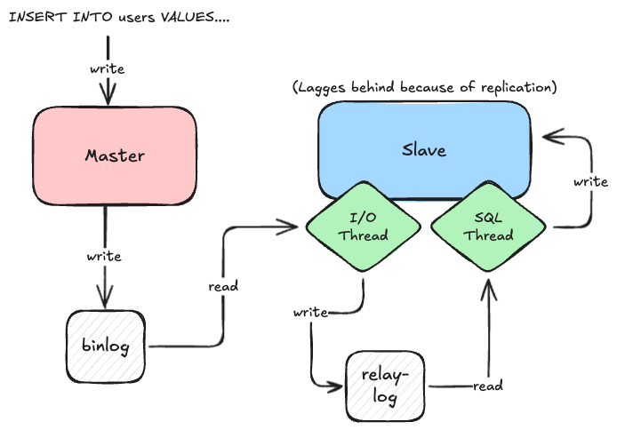

### Warum eigentlich Replikation?

:::warning[Was wäre, wenn...]
Was passiert, wenn die zentrale Datenbank im Unternehmen ausfällt?
:::

Wenn eine Datenbank der einzige zentrale Speicherpunkt ist, führt ein Ausfall zu:
- Produktionsstillstand  
- Datenverlust  
- Ausfallkosten  
- Imageschäden bei Kunden  

Replikation ist eine grundlegende Technik, um Systeme **robuster**, **skalierbarer** und **ausfallsicherer** zu gestalten.


### Ziele der Replikation

Replikation verfolgt mehrere betriebliche und technische Ziele:

- **Hochverfügbarkeit (High Availability)**  
  Daten bleiben auch bei Serverausfall erreichbar.  

- **Lastverteilung (Load Balancing)**  
  Leseanfragen können auf mehrere Server verteilt werden.  

- **Datensicherheit & Redundanz**  
  Kopien der Daten schützen vor Hardware- oder Softwarefehlern.  

- **Entlastung des Primärsystems**  
  Backups, Reports und Analysen laufen auf Replikas, nicht auf dem Master.  

- **Geografische Verteilung**  
  Systeme an unterschiedlichen Standorten erhalten synchronisierte Datenbestände.


:::tip[Merksatz]
Replikation bedeutet nicht Konsistenz, sondern Redundanz. 
:::

### Wie funktioniert Replikation in MySQL und MariaDB?

Replikation ist das kontinuierliche Kopieren von Änderungen vom **Master** auf einen oder mehrere **Slaves**.  
Dabei werden nicht komplette Datenbanken übertragen, sondern nur die **Transaktionen**, die am Master ausgeführt wurden.


### Ablauf im Detail

1. Der **Master** schreibt jede Änderung in das **Binary Log** (`binlog`).
2. Der **Slave** liest die Binlogs über seinen **I/O-Thread** und speichert sie im **Relay Log**.
3. Der **SQL-Thread** auf dem Slave führt die Anweisungen in derselben Reihenfolge aus.
4. Das Ergebnis ist eine zeitlich verzögerte, aber inhaltlich gleiche Kopie der Datenbank.




Der Master akzeptiert Schreiboperationen, die Slaves folgen passiv nach.  
Das bedeutet, die Daten auf den Slaves sind **repliziert**, aber nicht zwangsläufig **zeitgleich konsistent**.


### Eigenschaften

- **Asynchrone Übertragung:** Der Master wartet nicht auf Bestätigung der Slaves.  
- **Zeitverzögerte Ausführung:** Slaves hängen je nach Systemlast hinterher.  
- **Lesbare Replikas:** Slaves können Leseanfragen verarbeiten, um den Master zu entlasten.  
- **Ein Master, mehrere Slaves:** Typisches Muster für Web- oder Reporting-Umgebungen.


:::tip[Praxis]
Ein Slave kann hinterherhinken.  
Prüfe mit:

```sql
SHOW SLAVE STATUS\G
```
Der Wert Seconds_Behind_Master zeigt die Verzögerung in Sekunden.
:::
