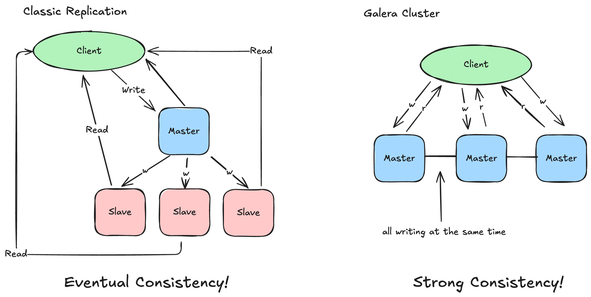

### Grenzen der Standard-Replikation

Wir haben gesehen, wie einfach sich eine Master-Slave-Replikation aufsetzen lässt. Sie ist ein bewährtes Mittel für:
- **Backups** (auf dem Slave)
- **Analysen/Reporting** (ohne den Master zu belasten)
- **Einfache Skalierung von Lesezugriffen**

Doch in modernen, hochverfügbaren Umgebungen stoßen wir schnell auf harte Grenzen:

#### 1. Datenverlust bei Ausfall (Asynchronität)
Da die Replikation standardmäßig **asynchron** läuft, bestätigt der Master eine Transaktion (`COMMIT`), *bevor* der Slave sie empfangen hat.
Fällt der Master in genau diesem Moment aus (z.B. Stromausfall, Crash), sind die letzten Transaktionen **verloren**.

:::warning[RPO > 0]
In der Standard-Replikation ist der **Recovery Point Objective (RPO)** immer größer als Null. Datenverlust ist im "Worst Case" nicht ausgeschlossen.
:::

#### 2. Komplexer Failover
Wenn der Master ausfällt, müssen wir:
1. Erkennen, dass er wirklich endgültig ausgefallen ist.
2. Den aktuellsten Slave finden (wer hat die meisten Binlogs?).
3. Diesen Slave zum neuen Master befördern.
4. Alle anderen Slaves auf den neuen Master umkonfigurieren (`CHANGE MASTER TO...`).
5. Die Applikation auf die IP des neuen Masters schwenken.

Das ist manuell fehleranfällig und langsam. Tools wie *Orchestrator* oder *MHA* können das automatisieren, erhöhen aber die Komplexität der Infrastruktur enorm.

#### 3. Keine Schreib-Skalierung
Egal wie viele Slaves wir hinzufügen: **Geschrieben wird nur auf dem Master.**
Wenn der Master bei 100% CPU/IO-Last ist, hilft kein weiterer Slave. Wir sind vertikal limitiert ("Scale Up").

---

### Die Lösung: Galera Cluster

Galera Cluster ist eine **synchrone Multi-Master** Replikationstechnologie. Sie löst genau diese Probleme.

#### Synchronität (Virtuell)
Galera garantiert, dass eine Transaktion entweder auf **allen** Knoten committed wird oder auf **keinem**.
Wenn ein Knoten ausfällt, haben die anderen garantiert den gleichen Datenstand.

:::tip[Kein Datenverlust]
Mit Galera ist ein **RPO von 0** möglich. Keine Transaktion geht bei einem Node-Crash verloren.
:::

#### Multi-Master (Active-Active)
Jeder Knoten kann Lese- **und** Schreibzugriffe verarbeiten.
- Keine Unterscheidung mehr zwischen "Master" und "Slave".
- Clients können sich mit jedem Knoten verbinden.
- Fällt ein Knoten aus, nutzen die Clients einfach einen anderen.

#### Automatische Node-Provisionierung
Ein neuer (oder reparierter) Knoten tritt dem Cluster bei und holt sich die Daten **automatisch** von einem Spender (Donor).
Kein manuelles Dump-Erstellen, kein Hantieren mit Binlog-Positionen.

### Vergleich: Standard vs. Galera

| Feature | Standard Replikation | Galera Cluster |
| :--- | :--- | :--- |
| **Replikationsart** | Asynchron | Synchron (Zertifizierungsbasiert) |
| **Datenverlust** | Möglich (bei Master-Crash) | Ausgeschlossen (bei Node-Crash) |
| **Failover** | Komplex / Manuell / Externe Tools | Automatisch / Transparent |
| **Schreiben** | Nur auf Master (1 Node) | Auf allen Nodes möglich |
| **Latenz** | Gering (Schreiben ist lokal schnell) | Etwas höher (Netzwerk-Roundtrip nötig) |
| **Konflikte** | Nicht möglich (nur einer schreibt) | Möglich (Zertifizierungsfehler bei gleichen Rows) |

### Wann Galera?

Galera ist die richtige Wahl, wenn:
- **Datenverlust inakzeptabel** ist (Banking, E-Commerce).
- **Hochverfügbarkeit** (24/7) gefordert ist.
- Manuelle Failover-Prozesse eliminiert werden sollen.

